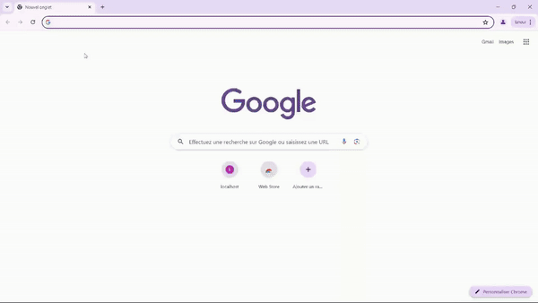

# 🛠️ Panel BOT Discord

## 📚 Description

Le Panneau d'Administration Discord est une application web conçue pour gérer les serveurs Discord, les utilisateurs, les rôles et les paramètres via une interface conviviale. Ce panneau permet aux administrateurs de connecter leur bot Discord, de visualiser et de gérer les données du serveur, et d'effectuer facilement des actions administratives.

## ⭐ Fonctionnalités

- 👥 **Gestion des Utilisateurs :** Afficher, bannir, expulser et renommer les utilisateurs.
- 🛡️ **Gestion des Rôles :** Afficher, supprimer et renommer les rôles.
- 🌐 **Gestion des Serveurs :** Afficher les serveurs, quitter les serveurs et envoyer des messages directs à tous les membres [DMALL]

## :rocket: Installation

- 💻 Prérequis installez git pour exécuter des clones sur votre terminal

   ```sh
   git clone https://github.com/yaed3v/simple-discord-admin-panel.git
   cd simple-discord-admin-panel
   npm install
   npm start

<div style="border: 2px solid #4CAF50; padding: 10px; border-radius: 5px; background-color: #f9f9f9;">
  <strong>⚠️ Important :</strong> Le serveur démarrera par défaut sur le port 3000. Ouvrez votre navigateur et naviguez vers <a href="http://localhost:3000">http://localhost:3000</a>.
</div>

````

